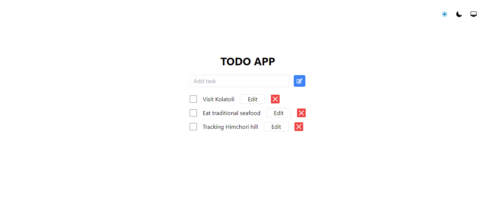

<h1>Todo App in React Js using React Context and useReducer
</h1>

<strong><u>Used tools and technologies</u></strong>
<ul>
    <li>React</li>
    <li>Tailwind CSS</li>
</ul>

<strong><u>Features</u></strong>
<ul>
    <li>Dark Mode</li>
</ul>

<strong><u>Output</u></strong>
 
<strong><i>Light Mode</strong>

<strong><i>Light Mode</strong>
